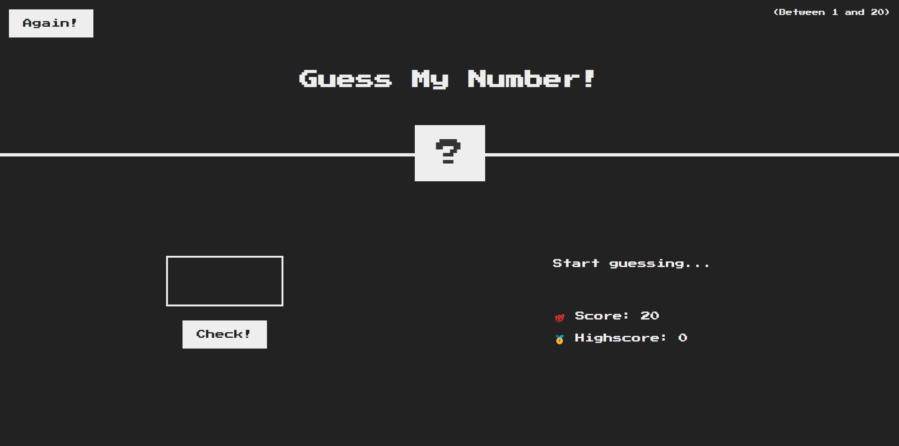

# Number Guessing Game

### Hello!

This simple game offers you an enjoyable opportunity to test your wits and instincts. The rules of the game are quite straightforward: you need to guess a randomly selected number between 1 and 20.

### Game Rules:

1. A random number will be chosen, and it will be between 1 and 20.
2. Your goal is to guess the correct number.
3. With each guess, the computer will inform you whether your guess is greater than, less than, or equal to the correct number.
4. You have a total of 20 attempts to guess the correct number.
5. Try to find the correct number with as few guesses as possible!

Good luck!

### How to Play:

1. Enter a guess (a number between 1 and 20) in the box below.
2. Click the "Check" button.
3. The computer will indicate whether the correct number is higher, lower, or equal to your guess.
4. Improve your guesses to find the correct number with the fewest attempts.

The purpose of this game is to have fun and enhance your mental skills. Each game starts with a different random number, so try it again and again to achieve the highest score!

We hope you have a great time and reach the top of the leaderboard. Start now and compete against luck!

